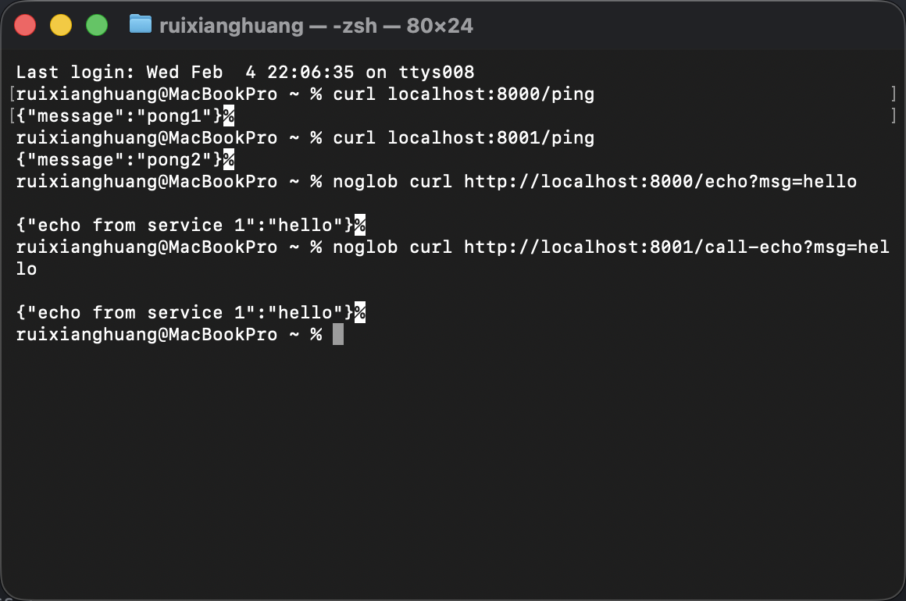

***Lab 1 Assignment for CMPE 293***

To start this project, use command 
``` 
docker-compose up --build
``` 
it will set up the container running on 8000 and 8001.

Use the following command to test:
1. Ping both service
    ``` 
    curl http://localhost:8000/ping
    curl http://localhost:8001/ping
    ```
    Expected output:
    ```
    {"message":"pong1"}
    {"message":"pong2"}
    ```
2. Test echo on service 1:
   ```
   noglob curl http://localhost:8000/echo?msg=hello
   or
   curl "http://localhost:8000/echo?msg=hello"
   ```
   Expected output:
   ```
   {"echo from service 1":"hello"}
   ```
4. Test call echo from service 2:
   ```
   noglob curl http://localhost:8001/call-echo?msg=hello
   or
   curl "http://localhost:8001/call-echo?msg=hello"
   ```
   Expected output:
   ```
   {"echo from service 1":"hello"}
   ```
After everything is done, use 
```
docker-compose down
```
to terminate the service

Failure Test:
Keep Service A alive, shutdown service B:
```
@MacBookPro ~ % curl "http://localhost:8000/echo?msg=hello"
{"echo from service 1":"hello"}%
@MacBookPro ~ % curl "http://localhost:8001/call-echo?msg=hello"
curl: (7) Failed to connect to localhost port 8001 after 0 ms: Couldn't connect to server
```
Keep Service B alive, shutdown service A
```
@MacBookPro ~ % curl localhost:8001/ping                        
{"message":"pong2"}%
@MacBookPro ~ % curl "http://localhost:8001/call-echo?msg=hello"
Internal Server Error%  
@MacBookPro ~ % curl "http://localhost:8000/echo?msg=hello"
curl: (7) Failed to connect to localhost port 8000 after 0 ms: Couldn't connect to server
```

Screenshot



**Refelection**

This system is a distributed system because it consists of two independently running services deployed in separate containers, each with its own memory space and network address. The services communicate via HTTP rather than direct function calls, meaning they can be deployed, scaled, and fail independently across different machines. This network-based coordination between independent nodes is the defining characteristic of a distributed system.
